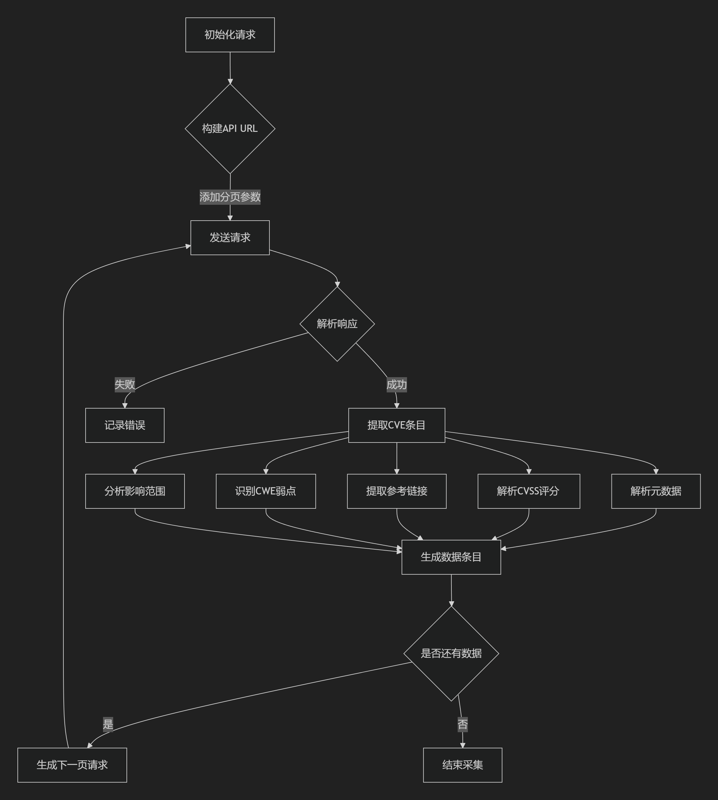

# 1. 项目概述

## 1.1 项目简介
CVECrawler 是一款基于Scrapy框架的NVD（国家漏洞数据库）数据采集工具，支持从[NVD API v2](https://nvd.nist.gov/developers/vulnerabilities)高效获取CVE（通用漏洞披露）数据。项目提供标准化JSON输出，适用于漏洞情报分析、安全监控系统数据源等场景。

## 1.2 核心特性
- **全量数据采集**：自动分页获取全部CVE记录；
- **智能限速**：动态调整请求频率，符合NVD API速率限制；
- **数据标准化**：结构化输出CVSS评分、受影响产品等关键字段；
- **可扩展架构**：模块化设计便于添加新功能；
- **生产级配置**：集成错误重试、缓存优化等企业级特性。

# 2. 快速开始

## 2.1 环境要求
- Python 3.8+
- Scrapy 2.8+
- dateutil 2.8.2+

# 2.2 首次运行
```shell
# 安装项目相关依赖
pip install -r requirements.txt

# 启用UTF-8编码
$env:PYTHONUTF8=1     # Windows系统
export PYTHONUTF8=1   # Linux系统

# 启动爬虫项目
scrapy crawl nvd_spider
```

# 3. 配置说明
编辑 settings.py 进行个性化配置。

## 3.1 核心参数
```python
# API认证
import os
NVD_API_KEY = os.getenv('NVD_API_KEY', 'your nvd api')  # 请在`https://nvd.nist.gov/developers/vulnerabilities`获取您的NVD API

# 请求控制
DOWNLOAD_DELAY = 6                                      # 基础请求间隔（秒）
CONCURRENT_REQUESTS = 2                                 # 并发请求数

# 输出配置
FEED_URI = 'cve_data_%(time)s.json'                     # 动态文件名模板
FEED_EXPORT_INDENT = 2                                  # JSON缩进级别
```

## 3.2 可选参数
| 参数  |  默认值 | 说明  |
|---|---|---|
|  `AUTOTHROTTLE_ENABLED` | `True`  |  启用智能限速 |
|  `HTTPCACHE_ENABLED` | 	`True`  | 启用响应缓存（减少API调用）  |
|  `RETRY_TIMES` | 	`3`  |  失败请求重试次数 |

# 4. 核心组件

## 4.1 爬虫架构


## 4.2 NvdApiSpider 类
核心方法包括：
- `build_api_url()`：
    - 动态构造API请求URL；
    - 处理分页；
    - 过滤参数。

```python
from urllib.parse import quote

def build_api_url(self):
    """
    动态构建API请求URL
    :return: API请求URL
    """
    params = []

    # 处理分页参数
    params.append(f"startIndex={self.params['startIndex']}")
    params.append(f"resultsPerPage={self.params['resultsPerPage']}")

    # 过滤参数
    if self.params.get('noRejected'):
        params.append("noRejected")

    # 关键词搜索处理
    if hasattr(self, 'keyword_search'):
        encoded_keyword = quote(self.keyword_search)
        params.append(f"keywordSearch={encoded_keyword}")
        # 精确匹配模式
        if hasattr(self, 'keyword_exact_match'):
            params.append("keywordExactMatch")
    return f"{self.base_url}?{'&'.join(params)}"
```

- `parse_cve()`：
  - CVE条目解析管道；
  - 提取CVE的关键字段。

```python
from cve_crawler.items import CVEEntry

def parse_cve(self, cve_data):
    """
    单个CVE条目解析器
    :param cve_data: 单个CVE数据
    :return: 解析好的CVE数据
    """
    item = CVEEntry()

    # 基础信息
    item['cve_id'] = cve_data.get('id', '')
    item['published_date'] = parse(cve_data.get('published', '')).isoformat()
    item['last_modified'] = parse(cve_data.get('lastModified', '')).isoformat()
    item['vuln_status'] = cve_data.get('vulnStatus', '')

    # 描述信息
    item['description'] = next((
        desc['value'] for desc in cve_data.get('descriptions', [])
        if desc.get('lang') == 'en'
    ), '')

    # CVSS评分信息
    self.parse_metrics(cve_data.get('metrics', {}), item)

    # 参考链接
    references = cve_data.get('references', [])
    item['references'] = [
        {
            'url': ref.get('url'),
            'tags': ref.get('tags', [])
        } for ref in references
    ]

    # CWE信息
    if weaknesses := cve_data.get('weaknesses'):
        item['cwe_ids'] = [
            weakness.get('description', [{}])[0].get('value')
            for weakness in weaknesses
        ]

    # 影响范围信息
    if configurations := cve_data.get('configurations'):
        item['affected_products'] = self.get_affected_products(configurations)

    return item
```

# 5. 数据模型

CVEEntry 数据结构包含：

| 字段                  | 类型          | 示例值                                  | 描述                                                                 |
|-----------------------|---------------|----------------------------------------|----------------------------------------------------------------------|
| `cve_id`               | String        | `CVE-2023-12345`                      | 标准CVE标识符（NVD官方编号）                                         |
| `vuln_status`          | String        | `"Analyzed"`                          | 漏洞状态（如：Analyzed/Rejected/Received）                           |
| `published_date`       | ISO8601       | `2023-01-15T08:00:00Z`                | 漏洞首次发布日期                                                     |
| `last_modified`        | ISO8601       | `2023-02-20T12:30:45Z`                | 漏洞最后修改日期                                                     |
| `description`          | String        | `"SQL注入漏洞允许远程攻击者..."`       | 漏洞详细描述（英文优先）                                             |
| `references`           | List[Dict]    | `[{"url":"http://...","tags":["Patch"]}]` | 参考链接列表（含URL和标签如`Vendor Advisory`）                       |
| `cwe_ids`              | List          | `["CWE-79", "CWE-89"]`                | 关联的CWE弱点类型编号列表                                             |
| `affected_products`    | List          | `["microsoft:windows_10", "apache:log4j"]` | 受影响产品列表（格式：`vendor:product`）                             |
| `cvss_v2_score`        | Float         | `7.5`                                  | CVSS v2.0基础评分（0.0-10.0）                                       |
| `cvss_v2_vector`       | String        | `"AV:N/AC:L/Au:N/C:P/I:P/A:P"`        | CVSS v2.0向量字符串（攻击向量/复杂度/权限等）                        |
| `cvss_v2_severity`     | String        | `"HIGH"`                               | CVSS v2.0严重等级（LOW/MEDIUM/HIGH）                                |
| `cvss_v3_score`        | Float         | `9.8`                                  | CVSS v3.1基础评分（0.0-10.0）                                       |
| `cvss_v3_vector`       | String        | `"CVSS:3.1/AV:N/AC:L/PR:N/UI:N/S:U/C:H/I:H/A:H"` | CVSS v3.1向量字符串（新版格式）                                     |
| `cvss_v3_severity`     | String        | `"CRITICAL"`                           | CVSS v3.1严重等级（LOW/MEDIUM/HIGH/CRITICAL）                       |

# 6. 扩展方法

## 6.1 添加过滤条件
```python
import scrapy

# 在spider类中新增属性
class NvdApiSpider(scrapy.Spider):
    keyword_search = "linux kernel"
    keyword_exact_match = True
    
# 生成的API请求将包含：
# &keywordSearch=linux%20kernel&keywordExactMatch
```

## 6.2 自定义输出
```python
# 修改settings.py
FEED_EXPORTERS = {
    'json': 'my_project.exporters.CustomJsonExporter'
}

# 创建 exporters.py
from scrapy.exporters import JsonItemExporter
class CustomJsonExporter(JsonItemExporter):
    def serialize_field(self, field, name, value):
        if name == 'cvss_v3_score':
            return round(float(value), 1)
        return super().serialize_field(field, name, value)
```

# 7. 维护策略

## 7.1 版本更新
| 组件  |  检查频率 |  	官方资源 |
|---|---|---|
| NVD API规范  | 每月  |  [NVD API文档](https://nvd.nist.gov/developers/vulnerabilities) |
| Scrapy框架  | 每季度  | [Scrapy Releases](https://scrapy.org/news/)  |


## 7.2 故障排查
常见问题包含：
1. 403 Forbidden 错误
   - 确认 `NVD_API_KEY` 有效且未过期
   - 检查请求头是否包含正确的认证信息
   ```python
    # 正确的请求头示例
    {'Authorization': 'Bearer xxxx', 'Accept': 'application/json'}
    ```
2. 数据重复或缺失
   - 启用HTTP缓存 `HTTPCACHE_ENABLED = True`
   - 检查分页参数 `startIndex` 的计算逻辑